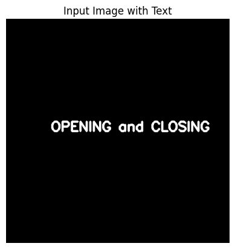
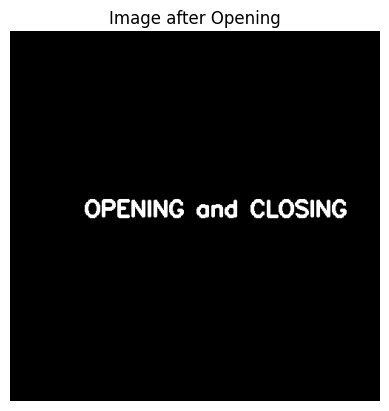
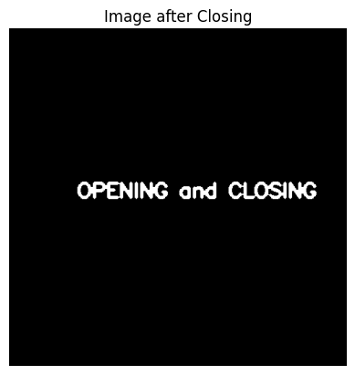

# OPENING--AND-CLOSING
## Aim
To implement Opening and Closing using Python and OpenCV.

## Software Required
1. Anaconda - Python 3.7
2. OpenCV

## Algorithm:
### Step1:
Import all the necessary modules for the program

### Step2:
Create an image using cv2.putText()

### Step3:
Create the structuring element either using np.ones or cv2.getStructuringElement()

### Step4:
Genrate the opening image using cv2.morphologyEx()

### Step5:
Generate the closing image using cv2.morphologyEx()

### Step6:
Display the images 

 
## Program:

### Developed by: Ashqar Ahamed S.T
### Register No: 212224240018

``` Python
# Import the necessary packages
import cv2
import numpy as np
from matplotlib import pyplot as plt

```
```py
# Create the text using cv2.putText
img = np.zeros((500, 500 ,3), dtype=np.uint8)
cv2.putText(img, 'OPENING and CLOSING', (100, 250), cv2.FONT_HERSHEY_SIMPLEX, 1, (255, 255, 255), 3)
```

```py
# Create the structuring element
kernel = np.ones((3,3), np.uint8)
```

```py
# Use Opening operation
img_opening = cv2.morphologyEx(img, cv2.MORPH_OPEN, kernel)
```


```py
# Use the Closing Operation
img_closing = cv2.morphologyEx(img, cv2.MORPH_CLOSE, kernel)

```

## Output:

### Display the input Image
<br>



### Display the result of Opening
<br>



### Display the result of Closing
<br>



## Result
Thus the Opening and Closing operation is used in the image using python and OpenCV.